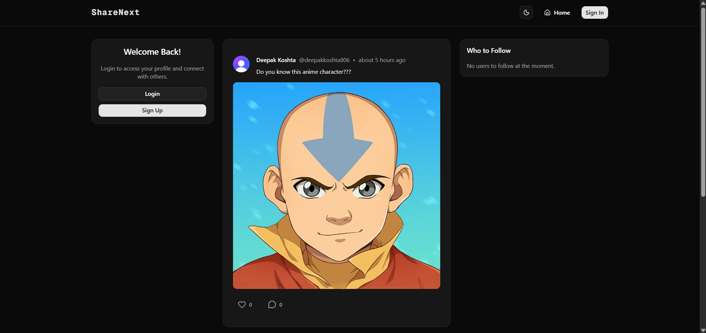

# ✨ ShareNext

A modern, full-stack social media platform focused on performance, scalability and clean user experience.

## 📸 Preview

## 🚀 Overview

ShareNext delivers a smooth and engaging social experience where users can create, share and interact with content seamlessly. It is designed with modern architecture and production-ready practices.

## 🔥 Key Features

- 📝 Seamless post creation and interaction
- 🖼️ Media upload with optimized handling
- 🔐 Secure authentication and user management
- 👤 Dynamic user profiles
- ⚡ Fast, responsive UI with server-driven rendering
- 🌐 Fully responsive across devices

## 🏗️ Tech Stack

- Frontend: Next.js, React, Tailwind CSS
- Backend: Next.js Server Actions / API Routes
- Database: PostgreSQL (Neon)
- Tools: Prisma, UploadThing, Clerk, TypeScript
